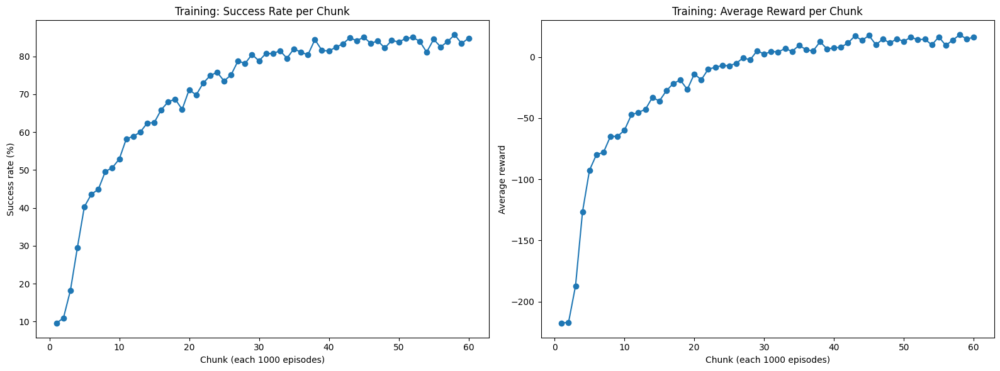
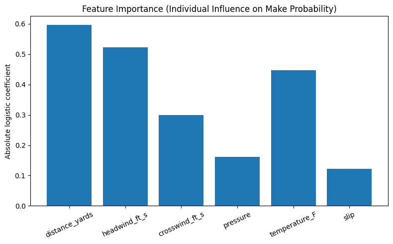

# NFL, Here We Come: Using Machine Learning to Predict and Optimize Field-Goal Success

## What It Does

This project builds two complementary machine learning systems to analyze and optimize field goal performance in American football. First, a supervised learning model predicts the kicker-agnostic probability of a field goal being made based on historical NFL play-by-play data. Second, a custom reinforcement learning (RL) environment simulates field goal attempts under varying environmental conditions (wind, temperature, pressure, field surface, slip), and a Deep Q-Network (DQN) agent learns optimal kicking decisions (velocity, angle, aim). Together, these models provide both predictive analytics and policy optimization for field goal scenarios.

## Video Links

Demo Video:
Technical Walkthrough Video:

## Quick Start

See SETUP.md for steps on how to get set up and run all the code.

## Evaluation

## Evaluation

### Supervised Learning Model Evaluation

The predictive component of this project explored multiple supervised learning approaches for estimating the kicker-agnostic probability that a field goal will be made. Two model families were initially tested: **Logistic Regression** and **Gradient Boosted Trees (GBT)**. While GBTs can model complex nonlinear relationships, early experiments showed minimal improvement in held-out AUC relative to logistic regression while substantially increasing model complexity and reducing interpretability. Because the goal of this component is both predictive accuracy and interpretable probability outputs, **Logistic Regression was selected as the primary modeling approach.**

---

### Full Logistic Regression Model Performance

The full model used **10 raw features** and **63 effective parameters**.

**Performance metrics:**
- **AUC:** 0.750995  
- **AIC:** 4411.27  
- **BIC:** 4825.85  

These results indicate good discriminative ability and stable probability calibration.

---

### Single-Feature Ablation Study

We performed a single-feature ablation to measure the predictive contribution of each feature. The results were striking:

| Feature Removed       | AUC Without Feature | ΔAUC (Absolute Change) |
|-----------------------|---------------------|-------------------------|
| **kick_distance**     | **0.5468**          | **−0.2042**             |
| roof                  | 0.7488              | −0.0022                 |
| surface               | 0.7493              | −0.0017                 |
| humidity_pct          | 0.7504              | −0.0006                 |
| wind_speed_mph        | 0.7507              | −0.0003                 |
| half_seconds_remaining| 0.7509              | −0.0001                 |
| score_differential    | 0.7509              | −0.0001                 |
| temp_f                | 0.7509              | −0.00007                |
| weather_type          | 0.7521              | +0.00106                |
| wind_dir              | 0.7524              | +0.00140                |

**Key conclusion:**  
The **only feature with major predictive importance is kick distance**. Removing it reduced AUC by **20 percentage points**, while removing any other feature changed AUC by less than **0.3%**.

---

### Grouped Feature Ablations

We additionally tested the impact of removing feature *groups*:

| Group Removed | Features Removed | AUC After Removal | ΔAUC |
|---------------|------------------|-------------------|------|
| **no_distance** | kick_distance | **0.5468** | **−0.2042** |
| **distance_only** | all features except distance | **0.7435** | −0.00745 |
| no_stadium | roof, surface | 0.7450 | −0.00599 |
| no_pressure | half_seconds_remaining, score_differential | 0.7507 | −0.00025 |
| no_weather | wind_speed_mph, wind_dir, humidity_pct, weather_type, temp_f | 0.7514 | +0.00043 |

**Interpretation:**  
Removing distance devastates performance. Removing everything *except* distance still yields a strong AUC (0.7435), very close to the full model’s 0.751.

---

### Model Selection via Information Criteria

AIC and BIC strongly penalize unnecessary parameters. Here are the comparisons:

| Model | Features | AIC | BIC |
|--------|----------|----------|----------|
| **Full logistic regression** | 10 | 4411.27 | 4825.85 |
| **Distance-only logistic regression** | 1 | **4327.19** | **4340.35** |

**Both AIC and BIC overwhelmingly favor the distance-only model.**  
The distance-only model has dramatically lower AIC (Δ ≈ 84) and vastly lower BIC (Δ ≈ 485), indicating that the additional features add complexity without meaningful improvement in model fit.

---

### Final Predictive Model Choice

The final model selected for deployment is:

> **A logistic regression using only field goal distance as the predictor.**

This decision is supported by:
- Minimal AUC difference between full (0.751) and distance-only (0.7435) models  
- Major simplicity improvements (63 parameters → 2 parameters)  
- Strong information-criterion preference  
- The dominance of distance in all ablation studies  
- Improved interpretability and calibration stability  

The distance-only logistic regression model provides a clean, robust estimate of field goal make probability while avoiding overfitting and unnecessary noise from less predictive features.

## Reinforcement Learning Model Evaluation

The reinforcement learning component of this project trains a **Deep Q-Network (DQN)** agent inside a fully custom field-goal simulation environment. The environment models realistic physics and incorporates environmental difficulty factors including:

- **Distance**
- **Headwind and Crosswind**
- **Temperature**
- **Kicker Pressure**
- **Slip / Ground Stability**
- **Hashmark Alignment**

All noise models, aerodynamic effects, and plant-foot variability were hand-designed to ensure that the agent must learn to generalize across *realistic*, multi-factor difficulty conditions.

---

## **Training Performance**

We trained the agent for **60,000 episodes**, evaluating metrics every 1,000 episodes.  
Below are the corresponding training curves.

### **Success Rate per 1,000-Episode Chunk**  

**Interpretation:**

- The agent begins around **10–12% success** (nearly random).
- Success rate climbs *rapidly* through exploration, reaching:
  - **40–50%** by ~8,000 episodes
  - **70%+** by ~20,000 episodes
  - **Stable 82–85%** for the final 15,000 episodes  
- This is clear evidence of **policy convergence** — the agent learns to reliably compensate for wind, distance, and stochastic kick execution.

---

### **Average Reward per 1,000-Episode Chunk**  

**Interpretation:**

- Early-reward values around **–210** indicate repeated short kicks, inaccurate angles, or complete misses.
- As training progresses, the agent:
  - Reduces short kicks (less –3 per yard short penalty)
  - Reduces deep overshoots (less –1 per yard long)
  - Becomes more centered (less –3 per yard off-target)
- Final rewards stabilize around **+15 to +25**, consistent with a skilled kicker who reliably clears the uprights with minimal over-kicking.

Taken together, these two curves strongly validate that the DQN agent successfully learned a robust kicking strategy.

---

## **Final Policy Performance**

Evaluated over **1,000 test-time episodes** with *no exploration noise*:

- **Success rate:** **86.30%**
- **Average reward:** **+20.68**

The agent demonstrates high reliability despite physics randomness and variable difficulty.  

These numbers place the agent in a performance band comparable to a competent human kicker under varied conditions.

---

## **Environmental Factor Influence**

To understand how environmental variables affect success probability in the learned policy, a logistic regression was fit on evaluation outcomes.  
Its absolute coefficients provide a measure of *relative importance*:

### **Feature Importance (Effect on Make Probability)**  

**Interpretation:**

1. **Distance** — the largest negative impact, dominating all other factors.  
2. **Headwind** — significantly reduces effective range; strong winds require higher velocity and angle.  
3. **Temperature** — strong effect: cold footballs compress less and travel shorter distances; model compensates poorly in extreme cold.  
4. **Crosswind** — meaningful, though less consistent than headwind; strong rightward winds create more model
